# TargetPlan
TargetPlan est un plugin pour I@nseo, le système de gestion des compétitions de Tir à l'Arc. Retrouver ce projet ici.  
- https://www.ianseo.net/
- https://www.facebook.com/ianseoarchery 

Ce plugin permet l'affectation des archers aux cibles de façon simplifié et graphique. 

## Principes généraux
Il est possible de faire l'affectation des cibles depuis les qualifications jusqu'aux phases finales.
Il intègre également des contrôles lors de l'affecation.
- Nombre d'archers par cible
- Contrôles de distances
- Nombre d'archers d'une même structure

## Installation

	<summmary>

## Installation  
Télécharger le fichier Zip depuis ce site (dépôt Git)  
[Retrouvez le lien ici](https://github.com/protheus6/IanseoModules/archive/refs/heads/main.zip).  
  

### Extraire les fichiers sur votre ordinateur.  
&rarr; Au clic droit sur le fichier précédemment téléchargé, vous devez extraire les données avec "Extraire tout"  
  
&rarr; Puis cliquer sur Extraire  
  
&rarr; Les fichiers sont en cours d'extraction  
  

  
&rarr; Ensuite vous allez ouvrir le fichier IanseoModules-main, ainsi que les sous menu pour arriver au dossier TargetPlan et menu.php 

  
&rarr; puis  
  
&rarr; puis  
  
&rarr; enfin selectionnez les deux éléments et au clic droit copier  
  

### Coller ces fichiers dans le répertoire de I@nseo  
 Pour ce faire, il vous faut copier ces deux éléments dans le menu "Custom" des modules de I@nseo.
 > *Chemin généralement utilisé par defaut:*\
 > C:\ianseo\htdocs\Modules\Custom  

  

### Redémarrer le serveur Apache
  
Enfin, profiter pleinement de ce module TargetPlan ! 

## Mise à jour de TargetPlan 
Pour le moment, il n'existe pas de mise à jour automatique de ce module.  
Lorsque vous mettez à jour I@nseo, ce module n'est pas effacé mais n'est pas non plus mis à jour. 
Il est necessaire de répéter les étapes d'installation afin de mettre à jour TargetPlan.  

## Erreur à l'installation possible Linux / Mac
Sur ces deux systemes d'exploitation, il est possible d'avoir quelques erreur lors du lancement du module.  
Ce message d'erreur est du à la redirection qui n'est pas nativement pris en charge.  

Il faudra donc suivre les éléments suivants afin d'autoriser la redirection relative.
### WIP

  

# Accès au module
Dans I@nseo, vous retrouverez TargetPlan depuis le menu **Module > TargetPlan > Qualifications**  
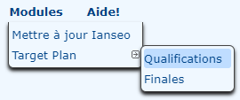  

# Qualifications
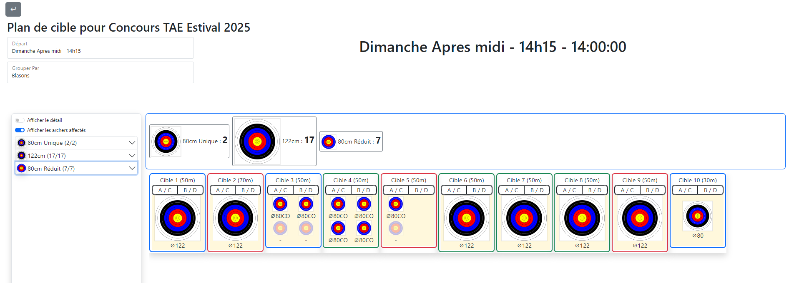
### Informations sur le départ
Dans la partie haute, on retrouve la compétition sélectionnée ainsi que le choix des départs issus de la compétition

### Type d'affichage du plan de cible
Le plan de cible peut être regroupé de la façon suivante:
- par blasons
- par catégories
### Archers à affecter
Dans la barre latérale gauche, vous pouvez retrouver les archers de votre départ classés comme indiqués précédemment.  

### Zone d'affectation (cibles)
Il est également possible de personnaliser cet affichage.On peut afficher/masquer le detail des cibles.  
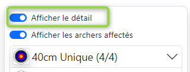

Enfin, il est possible de faire un filtre sur les archers restant à affecter, en décochant la case "Afficher les archers affectés".  
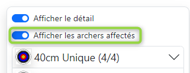  
Par defaut ce bouton est activé.

### Affectation des archers aux cibles
Pour affecter un particpant à une cible, il convient de faire glisser le nom de l'archer sur la lettre de la cible souhaitée.
Le blason s'affichera alors sur la cible, indiquant que la modification est bien prise en compte. 

Si vous affectez un archer sur une place déjà occupée par un autre acher, TargetPlan désaffectera le premier archer déjà affecté pour le remplacer par l'archer en cours d'affectation.  
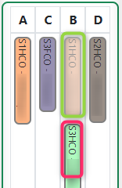

### Désaffectation d'un archer
Pour supprimer l'affectation d'un archer, il suffit simplement de faire un glisser déposer de l'archer en dehors du cadre de la cible pour désaffecter l'archer.

### Désaffectation en masse
Il est également possible de supprimer l'affectation d'une cible entière. Pour cela, il vous suffit de cliquer en haut à droite de la cible pour supprimer ces archers affectés.  
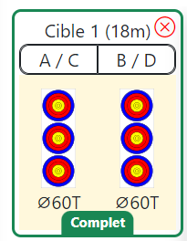

### Visualisation des structures
Lors de chaque ouverture de TargetPlan, le module affectera une couleur differentes à chaque structure. Cette couleur est générée aléatoirement. C'est à dire qu'elle varie à chaque ouverture de TargetPlan.

### Survol au-dessus des archers
En survolant la somme des blasons nécessaires, vous pouvez voir l'ensemble des archers nécessitant ce type de blasons.
À la sélection d'un archer déjà affecté ou bien en cours d'affectation, vous pouvez également visualiser l'ensemble des archers de cette même structure.

### Contrôles réalisés
Lors de l'affectation des archers aux cibles plusieurs contrôles sont effectués rendant l'affectation impossible ou soulevant des alertes visuelles.
- Libre
- Complet
- Structure Unique
- Majoritaire
- Conflits distances 

|Nombre d'archers par cible | Nombre d'archers par cible |
| :----: | :----: |
| Un seul archer par cible |Une seule structure est présente sur la cible
| 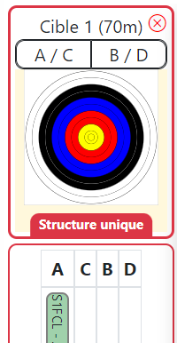 |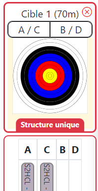 |

|Nombre d'archers par cible |
| :----: |
| Une majorité d'archers sur une même cible d'une même structure |
| 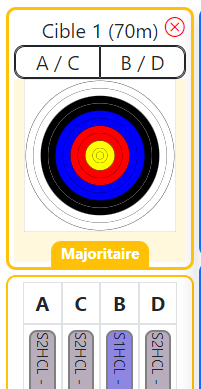 |

| Distances incohérentes sur la même cible | 
| :----: |
| Plusieurs archers avec des distances de tir différentes. | 
| 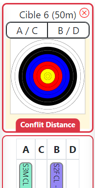 |

### Répartition des archers par blasons
En fonction de l'affectation, TargetPlan vous informe de la répartition des archers par type de blasons. 
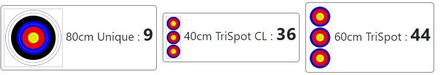

# Retour à I@nseo
Une fois votre mur de plan de cible réalisé, vous disposez de la flèche en haut à gauche pour retourner sur votre compétition I@nseo.

# Finales

## Paramétrage
Il reste néamoins necessaire de paramétrer les finales (Individuelles ou/et Équipe) dans I@nseo
> Se référer au manuel I@nseo Fédéral

## Accès au module
Comme la partie des qualification, il vous faut vous rendre dans le menu Modules de I@nseo  
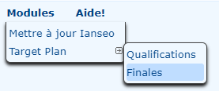

Vous retrouver sur la gauche dans le bandeau lateral, l'ensemble des épreuves déclarée dans I@nseo comme étant une phase éliminatoire/finales

## Configuration
Les temps indiqué dans ces paramétrages sont en minutes

### Individuel
Il est possible depuis l'interface de TargetPlan de définir la durée d'un duel et le temps d'échauffement necessaire avant ce dernier.  
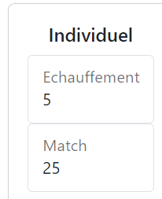

### Équipe
Il est possible depuis l'interface de TargetPlan de définir la durée d'un match et le temps d'échauffement necessaire avant ce dernier.  
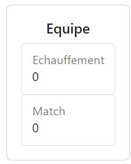

# Contributeurs
Ce projet existe grâçe à:  
 - **Protheus6**

# English version
## IanseoModules
Modules for Ianseo Project :
https://www.ianseo.net/
https://www.facebook.com/ianseoarchery

	-> Target Plan (menu: Modules->Target Plan)
		Manage competitor placement with a drag and drop graphical interface.