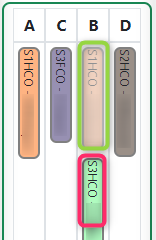
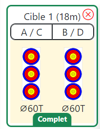
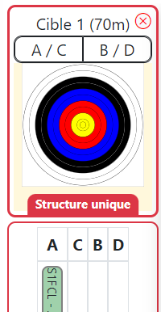
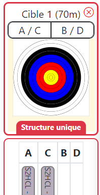
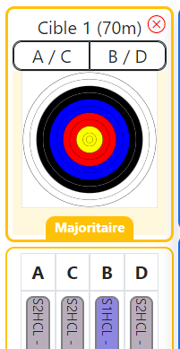
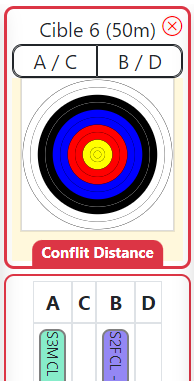
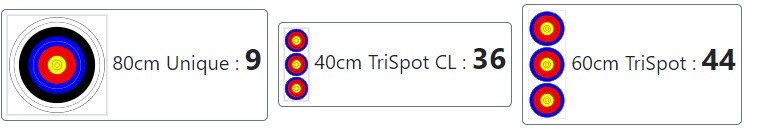

# TargetPlan
TargetPlan est un plugin pour I@nseo.
- https://www.ianseo.net/
- https://www.facebook.com/ianseoarchery 

Ce plugin permet l'affectation des archers aux cibles de façon graphique. 

## Principes généraux
Il est possible de faire l'affectation des cibles depuis les qualifications jusqu'aux phases finales.
Il intègre egalement des controles lors de l'affecation.
- Nombre de archers par cible
- Controles de distances (TAE / Beursault)
- Nombre de archers d'une même structure

## Installation

1. Télécharger depuis ce dépot le fichier Zip  
[Retrouvez le lien ici](https://github.com/protheus6/IanseoModules/archive/refs/heads/main.zip).  

2. Extraire les fichiers sur votre orfinateur.  
Il convient d'extraire le dossier TargetPlan et menu.php dans le répertoire Modules/Custom de I@anseo.  

 Pour ce faire, il vous faut copier ces deux élements dans le menu Custom des modules de I@nseo.
 > *Chemin généralement utilisé par defaut:*\
 > C:\ianseo\htdocs\Modules\Custom

3. Déplacer par copier/coller le dossier TargetPlan et le fichier menu.php dans le répertoire d'installation de I@nseo. 
Par défaut, le répertoire est le suivant:
Xxxxxxxwxxxxxxxxxxxxxxxxx

4. Etape 4
Redémarrer le serveur Apache de votre ordinateur

5. Étape 5
Profiter pleinement de ce module TargetPlan ! 

# Retour à I@nseo
Une fois votre mur de plan de cible réalisés, vous disposez de la flèche en haut à gauche pour retourner sur votre compétition I@nseo.

## Accès au module
Dans I@nseo, vous retrouverez TargetPlan depuis le menu Module > TargetPlan > Qualifications / Finales\

## Qualifications

### Informations sur le départ
Dans la partie haute on retrouve la compétition selectionnée ainsi que le choix des départs issue de la compétition

### Type d'affichage du mur de tir
Le plan de cible peut etre regroupé de la façons suivante:
- par blasons
- par catégories
### Archers à affecter
Dans la barre latéral gauche, vous pouvez retrouver les archers de votre départ classés comme indiqués précédement.
### Zone d'affectation (cibles)
Il est également possible de personaliser cet affichage. On peut afficher/masquer le details cibles (ne pas voir l'affectation). 
Enfin il est possible de faire un filtre sur les archers restant à affecter.

### Visualisation des structures
Lors de chaque ouverture de TargetPlan, le module affectera une couleur differentes à chaque structure. Cette couleur est générée aléatoirement. C'est à dire qu'elle varie à chaque ouverture de TargetPlan.

### Affectation des archers aux cibles
Pour affecter un particpant à une cible, il convient de faire glisser le nom de l'archer sur la lettre de la cible souhaitée.
Le blason s'affichera alors sur la cible, indiquant que la modification est bien prise en compte. 

Si vous affecter un archer sur une place déjà occupé par un autre achers, TargetPlan desaffectera le 1er archer déjà affecté pour le remplacer par l'archer en cours d'affectation.

### Desaffectation d'un archer
Pour supprimer l'affectation d'un archer, il suffit simplement de faire un glisser déposer de l'archer en dehors du cadre de la cible pour desaffecter l'archer.

### Desaffectation en masse
Il est également possible de supprimer l'affectation d'une cible entière. Pour cela, il vous suffit de cliquer en haut à droite de la cible avec de supprimer ces archers affectés.\

### Survol au dessus des archers. 
En survolant la sommes des blasons necessaire vous pouvez voir l'ensemble des archers necessitant ce type de blasons.
À la selection d'un archer déjà affecté ou bien en cours d'affectation vous pouvez egalement visualiser l'ensemble des archers de cette même structure.

### Controles réalisés
Lors de l'affectation des archers aux cible plusieurs controles sont effectué rendant l'affectation impossible ou soulevant des alertes visuelles.
- Libre
- Complet
- Structure Unique
- Majoritaire
- Conflits distances 

|Nombre d'archers par cible | Nombre d'archers par cible |
| :----: | :----: |
| Un seul archer par cible |Une seule structure est présente sur la cible
|  | |

|Nombre d'archers par cible |
| :----: |
| Une majorité de archers sur une meme cible d'une meme structure |
|  |

| Distances incohérantes sur la même cible | 
| :----: |
| Plusieurs archers avec des distances de tir differents. | 
|  |

### répartition des archers par blasons
En fonction de l'affectation TargetPlan vous informes de la répartition des archers par type de blasons. 

## Finales
En cours de rédaction.

# English version
## IanseoModules
Modules for Ianseo Project :
https://www.ianseo.net/
https://www.facebook.com/ianseoarchery

	-> Target Plan (menu: Modules->Target Plan)
		Manage competitor placement with a drag and drop graphical interface.